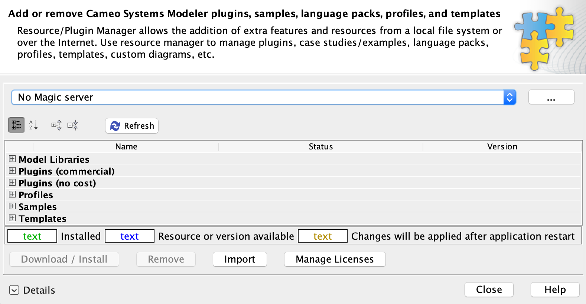
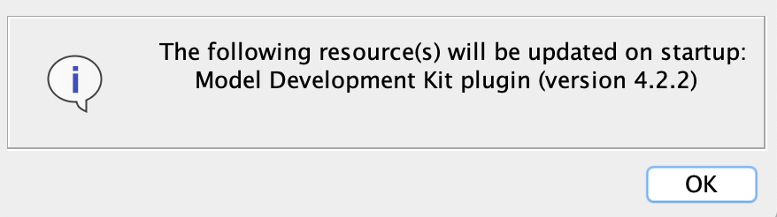
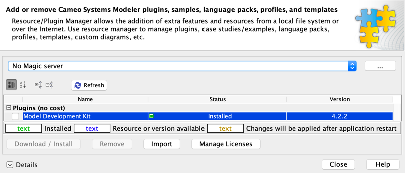

# Cameo MDK Systems Reasoner

   

Convenience tooling for UML/SysML inheritance using the Block Specific Type pattern. Cameo MDK Systems Reasoner is a plugin for [Cameo Systems Modeler](https://www.nomagic.com/products/cameo-systems-modeler) and other No Magic environment bundles.

# Quickstart

## Prerequisites

* [Cameo Systems Modeler (CSM)](https://www.nomagic.com/products/cameo-systems-modeler) or another No Magic environment bundle that includes the [SysML plugin](https://www.nomagic.com/product-addons/magicdraw-addons/sysml-plugin)
    * The latest Cameo MDK Systems Reasoner version is tested with and supports **2022 Refresh 1**. Compatibility for previous versions of Cameo MDK Systems Reasoner can be found in the [compatibility matrices](https://github.com/Open-MBEE/open-mbee.github.io/wiki/Compatibilities).

## Installation

1. [Download](https://github.com/Open-MBEE/mdk-systems-reasoner/releases/latest) the Cameo MDK Systems Reasoner plugin, e.g. `mdk-systems-reasoner-*-plugin.zip`.

2. Run CSM. From the main menu, select "Help" > "Resource/Plugin Manager".
   
   
3. Click "Import", navigate to the downloaded Cameo MDK Systems Reasoner plugin, and click "Open".

4. CSM should confirm installation with the following prompt.

   
   
5. Restart CSM. To check installation, select from the main menu "Help" > "Resource/Plugin Manager" > "Plugins (no cost)" and ensure a row exists for "MDK Systems Reasoner" and its status is "Installed" with the correct version.
  
  
> Cameo MDK Systems Reasoner can also be installed headlessly by simply unzipping the plugin archive into the directory that CSM is installed in.
  
## Usage

Documentation can be accessed [online](src/main/dist/manual) or offline in CSM from the main menu "Help" > "Other Documentation" > "MDK [...] UserGuide".

# Local Development

Cameo MDK Systems Reasoner is a Java project that uses the [Gradle](https://gradle.org/) build tool. It can be imported as a Gradle project in IDEs like [IntelliJ](https://www.jetbrains.com/idea/) and [Eclipse](https://www.eclipse.org/ide/).

## Common Tasks
* `./gradlew dependencies` will download all necessary dependencies.
* `./gradlew assemble` will compile the plugin from source.
* `./gradlew distZip` will package the installable plugin.
* `./gradlew installDist` will install the plugin in a staging environment.
* `./gradlew runJava` will interactively run CSM with the plugin installed from the staging environment.

Task dependencies are declared such that all necessary prerequisites are executed/cached, e.g. `runJava` will first `dependencies`, `assemble`, `distZip`, etc.
